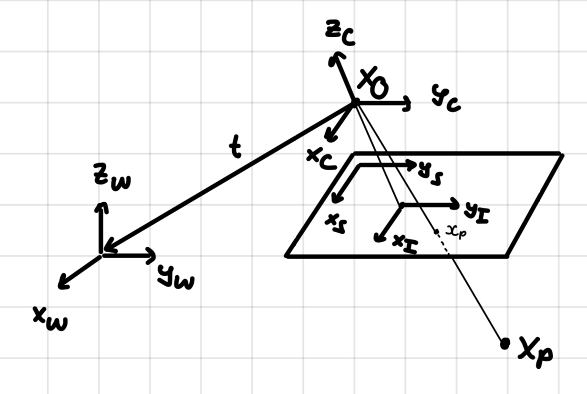

# Calibration - Theory

## Coordinate Frames

{ width=80% }

### world : **w**

$$
X_P = 
\begin{bmatrix}
X \\
Y \\
Z
\end{bmatrix} 
,
\tilde X_P = \tilde X_P^w = 
\begin{bmatrix}
X \\
Y \\
Z \\
1
\end{bmatrix} 
,
X_O = 
\begin{bmatrix}
o_x \\
o_y \\
o_z
\end{bmatrix}
$$

### camera : **c**

$$
X_P^c = 
\begin{bmatrix}
X_c \\
Y_c \\
Z_c
\end{bmatrix} 
,
\tilde X_P^c = 
\begin{bmatrix}
\tilde X_c \\
\tilde Y_c \\
\tilde Z_c \\
\tilde W_c
\end{bmatrix} 
,
\begin{bmatrix}
X_c \\
Y_c \\
Z_c
\end{bmatrix} 
=
\begin{bmatrix}
\tilde X_c / \tilde W_c \\
\tilde Y_c / \tilde W_c\\
\tilde Z_c / \tilde W_c
\end{bmatrix} 
,
t = 
\begin{bmatrix}
t_x \\
t_y \\ 
t_z
\end{bmatrix}
,
t=-R*X_O
$$

### image plane : **$I$**

### sensor : **s**

$$
x_p =
\begin{bmatrix}
u \\
v
\end{bmatrix} 
,
\tilde x_p = \tilde x_p^s =
\begin{bmatrix}
\tilde u \\
\tilde v \\
\tilde w
\end{bmatrix} 
,
\begin{bmatrix}
u \\
v
\end{bmatrix}
=
\begin{bmatrix}
\tilde u / \tilde w \\
\tilde v / \tilde w
\end{bmatrix} 
$$

## Projection Geometry

### Projection from world to camera

$$
\begin{bmatrix}
X_c \\
Y_c \\ 
Z_c
\end{bmatrix}
=
\begin{bmatrix}
R & -R*X_O
\end{bmatrix}
*
\begin{bmatrix}
X \\
Y \\
Z \\
1
\end{bmatrix}
$$

$$
X_P^c = R*(X_P-X_O)
$$

$$
X_P = R^T*X_P^c + X_O
$$

### Projection from camera to sensor

$$
\begin{bmatrix}
\tilde u \\
\tilde v \\ 
\tilde w
\end{bmatrix}
=
\begin{bmatrix}
f_x &  s  & c_x \\
0   & f_y & c_y \\
0   & 0   & 1 
\end{bmatrix}
*
\begin{bmatrix}
X_c \\
Y_c \\
Z_c
\end{bmatrix}
$$

$$
\tilde x_p = K*X_P^c
$$

$$
X_P^c = \lambda*K^{-1}*
\begin{bmatrix}
x_p \\
1
\end{bmatrix}
$$

Note: All points along a ray that passes through the camera origin map to the same pixel coordinates. Going from pixel coordinates to 3d coordinates has an infinite solution space with 1 DoF, the distance along the ray.

### Projection from world to sensor

$$
\begin{bmatrix}
\tilde u \\
\tilde v \\
\tilde w
\end{bmatrix} 
=
\begin{bmatrix}
f_x &  s  & c_x \\
0   & f_y & c_y \\
0   & 0   & 1 
\end{bmatrix}
*
\begin{bmatrix}
R & -R*X_O
\end{bmatrix}
*
\begin{bmatrix}
X \\
Y \\
Z \\
1
\end{bmatrix} 
$$

$$
\tilde x_p = K*R*(X_p-X_O)
$$

$$
X_p = \lambda * (K*R)^{-1} + X_O
$$

when $Z=0$, the relation simplifies to

$$
\begin{bmatrix}
\tilde u \\
\tilde v \\
\tilde w
\end{bmatrix} 
=
\begin{bmatrix}
f_x &  s  & c_x \\
0   & f_y & c_y \\
0   & 0   & 1 
\end{bmatrix}
*
\begin{bmatrix}
r1 & r2 & -R*X_O
\end{bmatrix}
*
\begin{bmatrix}
X \\
Y \\
1
\end{bmatrix}
$$

$$
\tilde x_p = H*
\begin{bmatrix}
X \\
Y \\
1
\end{bmatrix}
$$

$$
\begin{bmatrix}
\tilde X \\
\tilde Y \\
\tilde W
\end{bmatrix}
=
H^{-1}*
\begin{bmatrix}
u \\
v \\
1
\end{bmatrix}
$$

Note: Restricting the object points to lie on a plane, the mapping from world to pixel coordinates becomes invertible, since it maps from 2d to 2d and doesn't have loss of information.

### Distortion

$$
\begin{bmatrix}
x \\
y \\
\end{bmatrix}
=
\begin{bmatrix}
X_c / Z_c \\
Y_c / Z_c \\
\end{bmatrix}
$$

$$
\begin{bmatrix}
x_d \\
y_d \\
\end{bmatrix}
=
\begin{bmatrix}
x + \Delta x(x_d, y_d, q) \\
v  + \Delta y(x_d, y_d, q
\end{bmatrix}
$$

$$
\begin{bmatrix}
u_d \\
v_d \\
1
\end{bmatrix}
=
K*
\begin{bmatrix}
x_d \\
y_d \\
1
\end{bmatrix}
$$

OpenCV models radial and tangential distortion with five parameters:

$$
q = (k1, k2, p1, p2, k3)
$$

$$
\Delta x_{radial}(x, y, q) = x*(k1*r^2 + k2*r^4 + k3*r^6)
$$
$$
\Delta y_{radial}(x, y, q) = y*(k1*r^2 + k2*r^4 + k3*r^6)
$$
$$
\Delta x_{tangential}(x, y, q) = 2*p1*x*y + p2*(r^2+2*x^2)
$$
$$
\Delta y_{tangential}(x, y, q) = p1*(r^2 + 2*y^2) + 2*p2*x*y
$$

