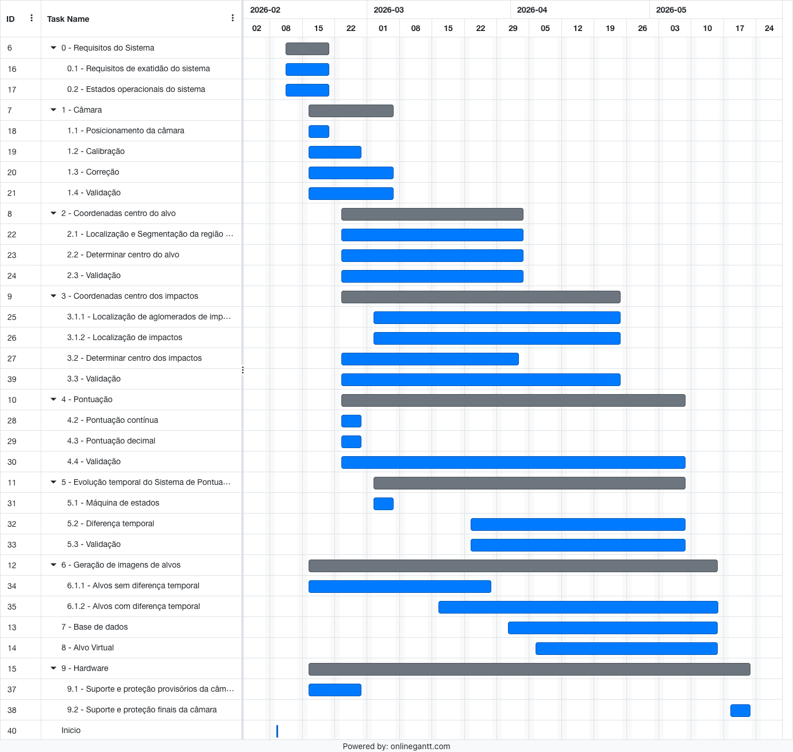

# Diagrama de Gantt

## 0 - Requisitos do sistema

#### 0.1 - Requisitos de exatidão do sistema
* Definir métricas operacionais para avaliar a exatidão do sistema.
    * concordância de pontuação : $A_{\Delta}$
* Definir valores objetivo para as métricas operacionais.
    * $A_{0.0} = 80\%$, $A_{0.1}=99\%$
* Traduzir requisitos operacionais para requisitos técnicos.
    * Erro de pontuação contínua : $E_{max}$
    * Erro de localização em píxeis : $E_{max}^{px}$
    * Densidade de píxeis no plano do alvo : $\rho_{target}$ [px/mm]
    * Resolução da câmara : $R_{cam}$

#### 0.2 - Estados operacionais do sistema
* Definir todos os estados e transições dos alvos durante operação.

## 1 - Câmara

### 1.1 - Posicionamento da câmara
* Definir o posicionamento ótimo da câmara de forma a minimizar erros óticos.

### 1.2 - Calibração
* Seleção de padrões de calibração intrínseca
    * padrão de xadrez
    * ChArUco
* Definir estratégias de calibração intrínseca
* Definir estratégias de calibração extrínseca
* Fazer design de padrão de xadrez e de ChArUco
* Implementar captura de imagens de calibração
* Implementar calibração intrínseca
* Implementar calibração extrínseca

### 1.3 - Correção
* Definir estratégia de correção de perspetiva
    * ponto central da imagem
    * resolução da imagem
* Implementar correção de imagem (distorção + perspetiva)

### 1.4 - Validação

#### 1.4.1 - Validar calibração intrínseca
* Quantidade de imagens de calibração usadas
* Erro de reprojeção

#### 1.4.2 - Validar correção de perspetiva
* Validação geométrica
* Validar visualmente se alvos ficam aproximadamente centrados

## 2 - Coordenadas centro do alvo

### 2.1 - Localização e Segmentação da região preta do alvo
* Implementar abordagem baseada em CNN para localização da região preta do alvo
* Implementar abordagem baseada em métodos clássicos para segmentação da região preta do alvo

### 2.2 - Determinar centro do alvo
* Implementar diversos métodos para obtenção do centro do contorno circular
    * Bounding Box
    * Análise de momentos (centro de massa)
    * Hough Transform
    * Regressão de círculo
        * regressão linear - solução fechada
        * regressão não linear - métodos iterativos

### 2.3 - Validação

#### 2.3.1 - Validar deteção do centro do alvo
* Usar alvos reais com anotação do centro do alvo real (anotação manual apresenta algum erro)
* Usar contornos gerados artificialmente com imperfeições (ruído, obstruções)

## 3 - Coordenadas do centro dos impactos

### 3.1 - Localização e Segmentação de impactos

#### 3.1.1 - Localização de aglomerados de impactos
* Implementar abordagem baseada em CNN para localização de aglomerados de impactos
    * Yolo
    * Faster R-CNN
    * Customizado
* Implementar abordagens de segmentação para impactos sobrepostos
    * Watershed

#### 3.1.2 - Localização de impactos
* Implementar abordagem baseada em métodos clássicos para localização de impactos
    * Hough Transform
* Implementar abordagem baseada em CNN para localização de impactos
    * Yolo
    * Faster R-CNN
    * Customizado
* Implementar abordagens de segmentação para impactos sobrepostos
    * Watershed

### 3.2 - Coordenadas centro dos impactos
* Implementar diversos métodos para obtenção do centro do contorno circular
* Métodos semelhantes ao ponto 2.2

### 3.3 - Validação

#### 3.3.1 - Avaliar performance de localização
* Definir critério de validação da localização baseado em precision e recall

#### 3.3.2 - Validar centro dos impactos
* Usar alvos reais com anotação do centro do alvo real (anotação manual apresenta algum erro)
* Usar contornos gerados artificialmente com imperfeições (ruído, obstruções)
* Semelhante à validação em 2.3.1, mas ajustado à dimensão dos impactos.

## 4 - Pontuação

### 4.1 - Coordenadas relativas
* Implementar função de coordenadas relativas partindo das coordenadas do centro do alvo e do centro de cada impacto

### 4.2 - Pontuação contínua
* Implementar função que mapeia distância ao centro em pontuação contínua

### 4.3 - Pontuação decimal
* Rever regras de pontuação 
    * casos limite
* Implementar passagem de pontuação contínua para pontuação decimal

### 4.4 - Validação

### 4.4.1 - Concordância de pontuação decimal
* testar concordância de pontuação decimal em comparação com outro sistema de pontuação ($A_{0.0}$, $A_{0.1}$)
    * avaliar as diferentes alternativas dos algoritmos desenvolvidos

## 5 - Evolução temporal do sistema de pontuação

### 5.1 - Máquina de estados
* Elaborar/desenhar máquina de estados para a operação do sistema de pontuação.

### 5.2 - Diferença temporal
* Implementar diferença temporal entre duas imagens
    * Verificar se alinhamento de imagens é necessário

#### 5.2.1 - Deteção de alvo
* Implementar deteção de presença de um alvo

#### 5.2.2 - Localização e Segmentação
* Implementar localização e segmentação usando imagens de diferença temporal
* usar métodos clássicos
* eventualmente usar métodos baseados em CNN

### 5.3 - Validação

* Validar deteção correta de novos impactos ao longo do tempo
* Avaliar falsas deteções em ausência de novos impactos
* Verificar consistência das transições da máquina de estados

## 6 - Geração de imagens de alvos

### 6.1 - Criação de impactos nos alvos

#### 6.1.1 - Alvos sem diferença temporal
* CNN de localização do centro do alvo
* CNN de localização dos impactos
* definir protocolo de criação dos alvos
* definir protocolo de recolha de imagens

#### 6.1.2 - Alvos com diferença temporal
* CNN de localização dos impactos
* definir protocolo de criação dos alvos
* definir protocolo de recolha de imagens
    * proteção da câmara

## 7 - Base de dados 

* Definir dados a armazenar
* Definir estrutura da base de dados
* Criar Base de dados

## 8 - Alvo Virtual

* criar aplicação desenho de um alvo virtual com impactos, com as informações relevantes em forma de tabelas.

## 9 - Hardware e suporte

### 9.1 - Suporte e proteção provisórios da câmara
* suporte provisório - tripé
* proteção provisória - ?

### 9.2 - Suporte e proteção finais da câmara
* suporte final - estrutura rígida
* proteção final:
    * integrada no suporte final ?
    * parte separada ?